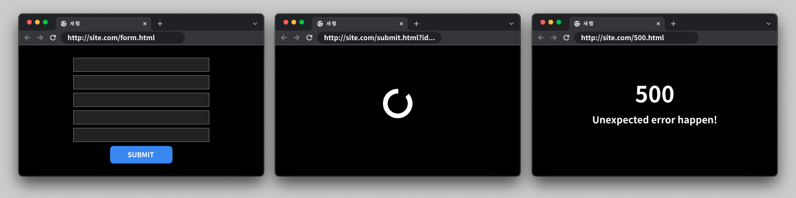
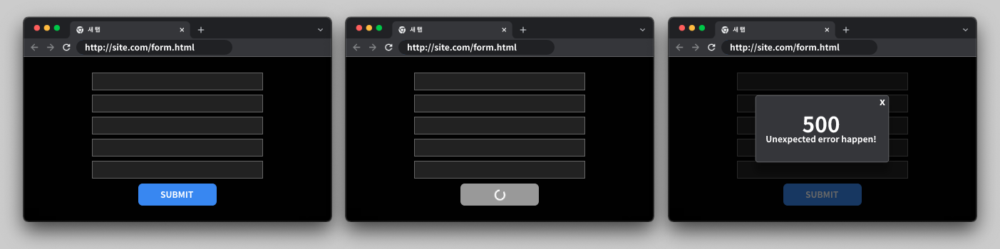
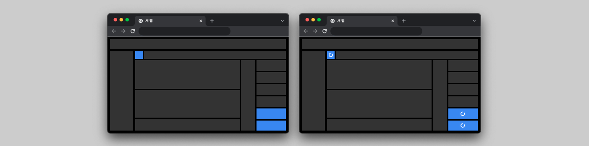

# Recoil, Suspense, and ErrorBoundary

Recoil은 `selector` 를 통해 비동기 네트워크 요청을 통한 상태설정 - [Asynchronous Data Queries](https://recoiljs.org/docs/guides/asynchronous-data-queries) - 을 지원하고, 구독 기반의 `Derived State` 을 잘 활용하면 컴포넌트로부터 템플리팅을 제외한 대부분의 데이터 기반 로직을 분리하여 유려한 관심사 분리를 구현해낼 수 있다.

그러나 Recoil `selector` 를 통해 비동기 요청을 수행하는 경우, 반드시 해당 `selector` 를 사용하는 컴포넌트를 Suspense로 감싸주어야 한다. 또한, `selector` 에서 API 응답에 따른 에러를 반환하는 경우, 이를 해소하기 위한 ErrorBoundary의 사용 역시도 필수적이다.

Suspense 와 ErrorBoundary는 기존의 React 어플리케이션 개발 중에는 신경쓰지 않아도 되었던 특정한 구조를 강제하는데, 이 때문에 처음 접하게될 경우 불필요한 코드가 추가되거나, 버그나 한계점이 존재하는 것으로 느껴질 수 있다. Suspense와 ErrorBoundary가 강제하는 이러한 구조가 필요한 이유가 무엇인지, 이를 통해 우리는 어떤 이점을 가져갈 수 있는지 알아보자.

**FYI.**

- Recoil 은 ErrorBoundary와 Suspense의 사용을 강제한다.
- ErrorBoundary는 에러처리중앙화 관점에서 효용성이 없어보이지만, 에러처리의 편의를 제공한다.
- Suspense는 기존 서비스의 UX 품질저하를 일으키는 것 같지만, 컴포넌트 분리를 통해 UX 설계 편의를 제공한다.

## ErrorBoundary 그리고 Recoil

### AJAX의 등장과 비동기에러 처리

[AJAX](https://ko.wikipedia.org/wiki/Ajax) 등장 이전의 웹은 다른 화면을 보여주기 위해서는 전체 페이지를 새로 요청하는 방법밖에 없었다.

예를 들어, 복잡한 휴대폰 구매 계약 문서를 작성 중이었다고 해보자. 문서의 작성을 모두 끝내고, Submit 버튼을 눌렀을 때에, 무언가 잘못 작성되어 서버로부터 에러를 전달받았다. 에러를 보여주기 위해 브라우저는 에러페이지로 이동한다. 이전에 시간을 들여 작성한 문서는 모두 사라지고 다시 처음부터 작성해야된다.



AJAX의 역할은 여러가지가 있겠지만, 이런 경우를 해결하는 것 역시 큰 관심사 중에 하나였다.

휴대폰 구매 계약 문서가 화면에 그려져 있는 채로, Submit 버튼의 요청이 비동기로 서버로 전송되고, 성공하거나 실패했을 경우, Toast 팝업을 통해 결과를 안내해 줄 수 있다. 잘못 작성했더라도 처음부터 다시 작성할 필요가 없고, 어느 부분이 에러를 일으킨 요인인지 표시해줄 수도 있다.



이런 AJAX의 등장으로 웹의 표현력은 크게 상승했고, 보다 유려한 UX를 구현할 수 있게 되었지만, JavaScript 코드는 복잡해질 수 밖에 없게 되었다. 그 대표적인 예로, 기존에는 신경쓰지 않아도 되었던 새로운 종류의 에러의 등장을 꼽을 수 있다.

- 서비스의 전체 이용을 중단해야하는 동기에러  
  : 다른 JavaScript의 동작을 pending 시키는 동기 요청에서 발생하는 에러
- 서비스의 이용을 유지하면서 안내되어야 하는 비동기에러  
  : 다른 JavaScript의 동작을 유지하는 비동기 요청에서 발생하는 에러

### SPA 라이브러리로서의 React

React는 최초에 [SPA](https://en.wikipedia.org/wiki/Single-page_application)로서 기획되고 개발되었다. 최근에는 단순히 React를 SPA 라이브러리라고 얘기하기는 어려워졌지만, 시작은 그랬다.

SPA, 즉 Single Page Application은 단일 웹페이지에서 동적인 데이터의 변경에 따라 다양한 UI를 보여주기 위한 어플리케이션 개발 방법이다. 필요에 따라 서버사이드에서의 prefetch를 통해 미리 데이터를 수급할 수 있지만, 기본적으로는 렌더링이 완료된 단일 페이지에서 비동기 [AJAX](https://developer.mozilla.org/en-US/docs/Web/Guide/AJAX) 요청을 통한 데이터의 수급을 전제로 한다.

```tsx
const Component = () => {
  const [data, setData] = useState();

  // 컴포넌트 렌더링 이후 비동기로 데이터 요청
  useEffect(() => {
    const loadData = async () => {
      const response = await fetchData();
      setData(response);
    };
    loadData();
  });

  // 데이터의 변경에 따른 렌더링 수행
  return (
    <div>
      {data.map((item) => (
        <div>{item.id}</div>
      ))}
    </div>
  );
};
```

데이터를 수급하는 방법을 비동기 요청으로 일원화하는 것은 SPA에서 자연스럽고 명쾌한 해결책이었지만, 이는 에러처리 관점에서는 전에 없던 혼란을 가중시킬 수 밖에 없다. 모든 에러가 비동기요청의 결과로 획득되는 환경에서 보다 웹 어플리케이션이 복잡해질 수록, 개발자는 큰 혼란에 빠진다.

"어떤 에러는 서비스를 중단시켜야하고, 어떤 에러는 단순히 표시되거나 무시될 수 있을까?"

### 에러처리중앙화

이렇게 복잡 다양해지는 에러를 한 곳에서 한번에 처리하고자 고안된 방법이 [에러처리중앙화](https://blog.securityinnovation.com/blog/2010/12/centralize-error-handling.html)이다. 에러의 종류를 열거하고 한 코드 내에서 처리함으로 에러를 보다 쉽게 관리하도록 돕는다.

1. 처리되어야하는 방법에 따라 에러의 타입을 클래스로 선언한다.
2. 하나의 함수 혹은 클래스로 에러가 처리될 수 있도록 구성한다.
3. 에러 처리 코드에서 에러 타입에 따른 특정 동작을 수행한다.

이는 코드의 가독성을 높히는 데에는 도움이 되지만, 개발자는 여전히 어떤 에러를 언제 발생시키고 어떻게 처리해야할지를 직접 판단해야 한다. 단순히 에러를 반환하는 코드를 작성하기 위해서 이 코드가 모든 서비스 내에서 어떤 영향을 미치는지 개발자의 머리로 이해하고 있어야 한다.

### ErrorBoundary의 관심사분리

[ErrorBoundary](https://reactjs.org/docs/error-boundaries.html)는 자식 React 컴포넌트를 망가뜨리는 JavaScript 에러를 대신 처리하는 React 컴포넌트이다. 자식 컴포넌트의 렌더링, React 생명주기, constructure 에서 발생하는 에러를 처리할 수 있지만 컴포넌트를 망가뜨리지 않는 이벤트 핸들러, 비동기 코드 등의 에러는 처리하지 못한다.

> Note
>
> Error boundaries do **not** catch errors for:
>
> - Event handlers ([learn more](https://reactjs.org/docs/error-boundaries.html#how-about-event-handlers))
> - Asynchronous code (e.g. `setTimeout` or `requestAnimationFrame` callbacks)
> - Server side rendering
> - Errors thrown in the error boundary itself (rather than its children)

기존의 에러처리중앙화 관점에서 보면, 이러한 특성때문에 ErrorBoundary의 사용성 자체에 의구심을 가질 수 밖에 없다. 한 곳에서 동일하게 처리되지 못하는 에러는 관리하기가 어렵기 떄문이다. 그러나 Recoil 을 함께 사용하게되면 그 효용성을 크게 느낄 수 있다.

```tsx
const state = selector({
  key: "state",
  get: () => {
    throw new Error("Temporary Error Thrown");
  },
});
```

사용중인 `selector` 에서 에러를 발생시키면, 브라우저 콘솔을 통해 다음과 같이 ErrorBoundary를 적용하여 에러를 처리하라는 메세지를 확인할 수 있다.

```
The above error occurred in the <List> component:

    at List (http://localhost:3000/static/js/bundle.js:128:75)
    at Suspense
    at RecoilRoot_INTERNAL (http://localhost:3000/static/js/bundle.js:41492:5)
    at RecoilRoot (http://localhost:3000/static/js/bundle.js:41649:5)
    at App

Consider adding an error boundary to your tree to customize error handling behavior.
Visit https://reactjs.org/link/error-boundaries to learn more about error boundaries.
```

Recoil 은 공식문서를 통해 `selector` 내부에서 [발생한 에러는 ErrorBoundary를 통해 처리](https://recoiljs.org/docs/guides/asynchronous-data-queries#error-handling)될 수 있다고 안내하고 있다. 결과적으로, Recoil 상태의 초기값 설정간 발생하는 에러는 다음과 같이 처리된다.

1. Recoil 상태의 초기값은 사용하는 컴포넌트의 첫 렌더링 시에 설정된다.
2. Recoil 상태의 초기값 설정간 발생한 에러는 ErrorBoundary 를 통해 처리된다.
3. Recoil 상태 초기값 설정에 실패한 컴포넌트는 Fallback 컴포넌트로 대체된다.

이로써, 데이터의 에러로 인해 서비스될 수 없는 컴포넌트는 모두 자동으로 처리되었다. 이제 개발자가 신경써야하는 에러는 오직 ErrorBoundary를 통해 처리될 수 없는 비동기요청/이벤트핸들러에서 발생하는 비동기에러 뿐이다.

앞서 말했듯 유저 동작의 결과로 발생하는 이러한 비동기에러는 서비스를 망가뜨리지 않고 따로 처리되기 위해서 고안되었기에 애초에 중앙화되어 처리될 이유가 없다. 이제 개발자는 발생하는 컴포넌트에서 발생하는 모든 에러를 별도의 UI로 안내해주던지, 무시하던지, 로깅하던지, 필요에 따라 처리하면 그만이다. **개발자는 더이상 이 코드가 서비스를 망가뜨릴지 고뇌할 필요가 없다.**

## Suspense 그리고 Recoil

### Suspense VS Loadable

```tsx
const listState = selector({
  key: "listState",
  get: async () => {
    const response = await fetch("https://jsonplaceholder.typicode.com/todos");
    return response.json();
  },
});

const List = () => {
  const listState = useRecoilValue(listState);
  return (
    <div>
      {listState.map(({ title }) => (
        <button>{title}</button>
      ))}
    </div>
  );
};
```

위처럼 비동기 요청을 수행하는 `selector` 를 컴포넌트가 구독하게되면, 다음과 같은 에러가 발생한다.

```
Uncaught Error: List suspended while rendering, but no fallback UI was specified.

Add a <Suspense fallback=...> component higher in the tree to provide a loading indicator or placeholder to display.
    at throwException (react-dom.development.js:20349)
    at handleError (react-dom.development.js:22558)
    at renderRootSync (react-dom.development.js:22673)
    at performSyncWorkOnRoot (react-dom.development.js:22293)
    at scheduleUpdateOnFiber (react-dom.development.js:21881)
    at updateContainer (react-dom.development.js:25482)
    at react-dom.development.js:26021
    at unbatchedUpdates (react-dom.development.js:22431)
    at legacyRenderSubtreeIntoContainer (react-dom.development.js:26020)
    at Object.render (react-dom.development.js:26103)
```

Recoil은 내부에서 비동기 요청이 발생할 경우 [Suspense](https://reactjs.org/docs/concurrent-mode-suspense.html#what-is-suspense-exactly)를 사용하도록 개발되었다. 필요할 경우 `Loadable` 을 사용하여 Suspense 없이 컴포넌트 내에서 데이터의 로딩 상태와 값에 따른 UI를 구성할 수도 있다. 그러나 `Loadable` 을 사용한다 하더라도, 로딩되는 동안 렌더링에 필요한 데이터를 수급할 수 없기 때문에 Suspense 를 사용하는 것과 크게 다르지않게 Fallback UI를 구성해야한다.

```tsx
const List = () => {
  const { state, content } = useRecoilValueLoadable(listState);
  if (state === "loading") {
    console.log(content); // undefined 가 반환된다.
  }
  // loading 중에는 content가 설정되지않으므로 다른 템플릿을 렌더링할 수 밖에 없다.
  return content ? (
    <div>
      {content.map(({ title }) => (
        <button>{title}</button>
      ))}
    </div>
  ) : (
    <Fallback />
  );
};
```

또한, 하나의 컴포넌트가 여러 Recoil 상태를 구독하는 경우 모든 상태를 Loadable 을 사용하지 않는다면 어차피 예상치 못한 경우에 Suspense 에 의한 Fallback 렌더링이 발생하기 쉽다. 구독하는 Recoil 상태가 여러 다른 Recoil 상태값에 의존성을 가지는 파생된 상태라면 상황은 더욱 복잡해진다.

때문에 Wrapper 구조로 간단하게 UI가 분리되지않는 피할 수 없는 경우가 아니라면 Loadable 보다는 Suspense 를 활용하는 것이 관리에 용이하다.

### Suspense 그리고 UX

Suspense를 적용하게 되면 일부 서비스의 UX 품질저하를 느끼게 될 수 있다. 이런 UX의 변화는 Recoil 사용을 꺼리게되는 큰 원인 중 하나이다.


- 데이터가 필요한 일부 UI 때문에 큰 화면이 Fallback 으로 로딩됨.
- 데이터의 로딩 시간이 짧은 경우 잦게 화면이 깜빡임.

익숙한 방식으로 해결책을 떠올리게 되면 Loadable 을 적용하고, 이전에 준비된 데이터를 별도로 저장해둔 뒤, 데이터의 변경으로 인해 로딩이 발생할 경우, 저장해둔 이전 상태값을 렌더링하는 방식이 있을 것이다. 그러나 앞서 말했듯, 컴포넌트의 상태값 구독이 복잡해질 수록 이런 코드는 더더욱 복잡해질 수 밖에 없다.

답은 컴포넌트를 데이터 구독 기반으로 최소한의 크기로 분리한 뒤 Suspense를 적용하는 것이다.

컴포넌트 내부에 데이터에 의존적인 UI를 모두 컴포넌트로 분리하면 꽤 작은 단위까지 분리가 가능하다. 정확하게 필요한 크기까지 분리된 컴포넌트를 Suspense로 렌더링하게 되면 앞서 열거한 UX 품질저하는 해결될 수 있다.



- 데이터와 관련없는 다른 컴포넌트가 Fallback으로 렌더링 되지 않는다.
- 데이터의 로딩시간이 짧아 그에 의존하는 일부 컴포넌트가 깜빡여도 UX를 크게 해치지 않는다.

또한 유저는 자신의 행동의 결과로 화면의 어느 부분이 영향을 받는지 Fallback UI를 통해 쉽게 인지할 수 있어 UX 적인 이점을 취할 수도 있다.

물론 일반적인 페이지네이션 리스트의 경우, 목록 전체가 데이터에 의존적이기 때문에 페이지를 이동할 때마다 목록 전체가 깜빡이는 등, 해결하기 어려운 경우도 존재한다. 그러나 그 경우에도 생각해볼 여지는 존재한다.

- 유저가 페이지를 이동하고자 버튼을 클릭한 경우, 전체 목록이 "로딩 중" 으로 표시되는 것이 나쁜 UX일까?
- 기존에 로딩된 페이지의 목록이 계속해서 보여주는 것이 UX의 중요한 부분이라면, Infinite Scroll 을 적용하는 것이 맞지 않을까?

이런 질문들은 서비스에 필요한 더 나은 UX를 기획하는 중요한 단서가 될 수 있다. 화면의 어느 부분이 데이터에 의존적인지, 한 데이터의 변경이 어떤 화면에 영향을 미칠 수 있는지, Suspense로 잘 분리된 컴포넌트 구조는 일종의 UX 청사진으로 활용될 수도 있다.
